==================================================

.. contents:: Table of Contents

Objective
#########

Use this guide to explore the virtual Kubernetes (vK8s) capabilities F5 Distributed Cloud Services for simplifying deployment and management of distributed workloads 
across multiple clouds and regions. This will help you get familiar with the general pattern of deploying high-availability configurations by using Kubernetes Helm 
charts in a multi-node site, which can then be exposed to other services. This is a common use-case leveraging F5 Distributed Cloud Customer Edge (CE) for deploying a 
backend or a database, which can then be used in conjunction with Regional Edge (RE) deployments that consume and/or interact with the central CE location. 
In this guide we will use an example of a PostgreSQL database deployment in a High-Availability (HA) configuration on a CE and exposing it to a RE location(s) closer 
to end-users for lowered latency, improved performance, and data resiliency. 

The guide includes the following key steps: 

•	Preparing the environment for HA workload; 
•	Deploying HA PostgreSQL database to CE; 
•	Exposing CE services to RE deployment; 
•	Testing the connection from RE to DB. 

The resulting architecture will be a PostgreSQL database deployed in a HA config on Kubernetes running on several compute nodes within an AWS VPC, and exposing to via 
TCP Load Balancer to a service in a RE that reads and presents the database contents to the end-users, which is a perfect fit for a CE deployment.  
 
Each of the steps in this guide addresses a specific part of the whole deployment process and describes it in detail. Therefore, this guide can be completed step-by-step 
or by skipping some of the steps if you are already familiar with them.  

Pre-requisites 
##############

•	F5 Distributed Cloud Account 
•	AWS (or another cloud account) for deploying a CE Site 
•	A Web browser to test the connectivity from RE to DB  
•	Kubernetes CLI 

Deployment architecture
#######################

Distributed Cloud Sites on an AWS VPC, which provides ways to easily connect and manage the multi-cloud infrastructure. Such deployment results in a robust distributed app infrastructure with full mesh connectivity, and ease of management as if it were a single K8S cluster. It provides an ideal platform for several nodes to be provisioned in a high-availability configuration for a PostgreSQL database cluster. The services within this cluster can then be exposed to other app services by way of a TCP load balancer. 
 
The app services that consume database objects could reside close to the end-user if they are deployed in F5 Distributed Cloud Regional Edge, resulting in the following optimized architecture: 

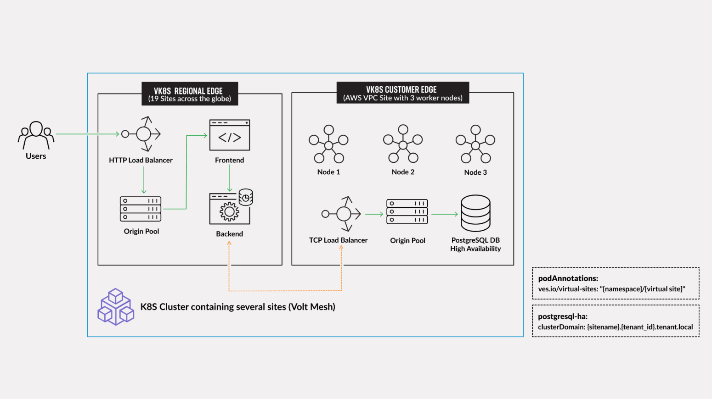

Step 1: Prepare environment for HA Load 
######################################
 
F5 Distributed Cloud Services allow creating edge sites with worker nodes on a wide variety of cloud providers: AWS, Azure, GCP. The pre-requisite is one or more Distributed Cloud CE Sites, and once deployed, you can expose the services created on these edge sites via a Site mesh and any additional Load Balancers. The selection of TCP (L3/L4) or HTTP/S (L7) Load Balancers depends on the requirements for the services to communicate with each other. In our case, since we’re exposing a database services, which is a fit for a TCP Load Balancer. Should there be a backend service or anything that exposes an HTTP endpoint for other services to connect to, we could have used an HTTP/S LB instead.  
Note that a single CE Site may support one or more virtual sites, which is similar to a logical grouping of site resources.  
 
A single virtual site can also be deployed across multiple CEs, thus creating a multi-cloud infrastructure. It’s also possible to place several virtual sites into one CE, each with their own policy settings for more granular security and app service management. It is also feasible for several virtual sites to share both the same and different CE sites as underlying resources. 
 
During the creation of sites & virtual sites labels such as site name, site type and others can be used to organize site resources. If you want to use site name to organize an edge site as a virtual site, then *ves.io/siteName* label can be used. 
 
The diagram shows how VK8S clusters can be deployed across multiple CEs with virtual sites to control distributed cloud infrastructure. Note that this architecture shows four virtual clusters assigned to CE sites in different ways.

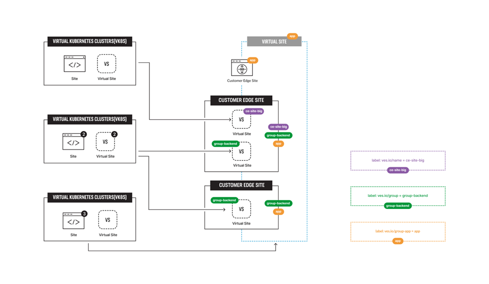

Creating an AWS VPC site
******************** 
 
Let's start creating the AWS VPC site with worker nodes. Log in the F5 Distributed Cloud Console and navigate to the **Cloud and Edge Sites** service, then to **Site Management** and select **AWS VPC Sites**. Click the **Add AWS VPC Site** button. 
   
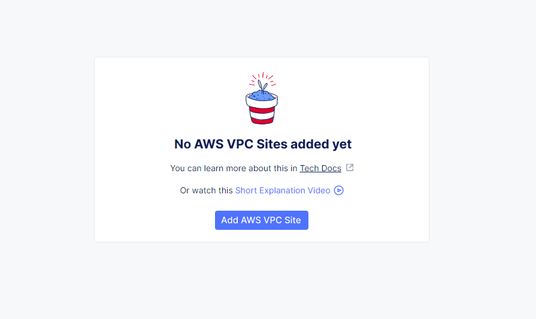
 
Then give the site a name and select the AWS Region for it. In this guide we use the **ca-central-1** region.  
 
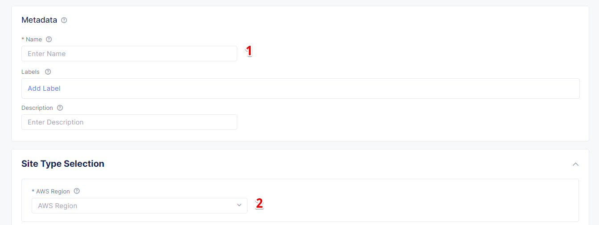
 
Enter the **10.0.0.0/16** CIDR in the Primary IPv4 CIDR block field and move on to set the node configuration. Under the Ingress Gateway (One Interface) click **Configure**. 
 
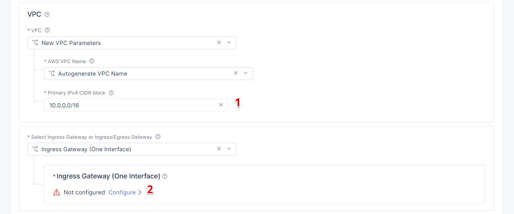
 
Click **Add Item** to configure the Ingress Gateway (One Interface). 
  
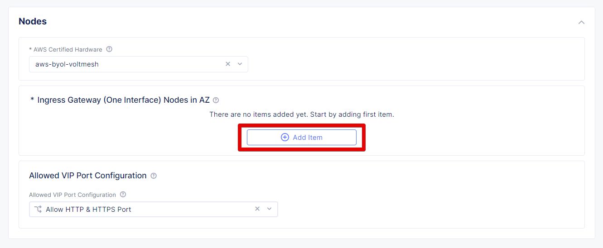
 
Now we will configure the first node: select **ca-central-1a** from the AWS AZ Name menu which matches the configured AWS Region. Enter new subnet address **10.0.1.0/24** in IPv4 Subnet. 
Click **Apply** to save the first node settings. 
 

 
Click again the **Add Item** button to configure the second node. 
  
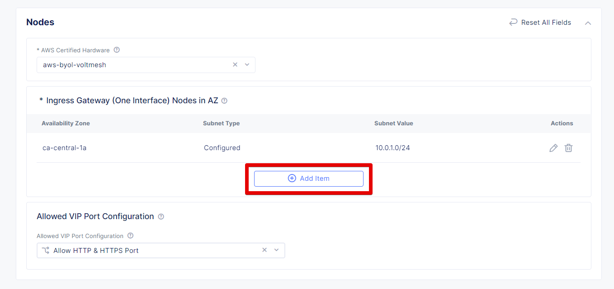
 
Let's now configure the second node: select **ca-central-1b** from the AWS AZ Name menu and enter new subnet address **10.0.2.0/24** in IPv4 Subnet. Then click **Apply** to save the node settings. 
 

 
Click the **Add Item** button one more time to configure the third node. 
 
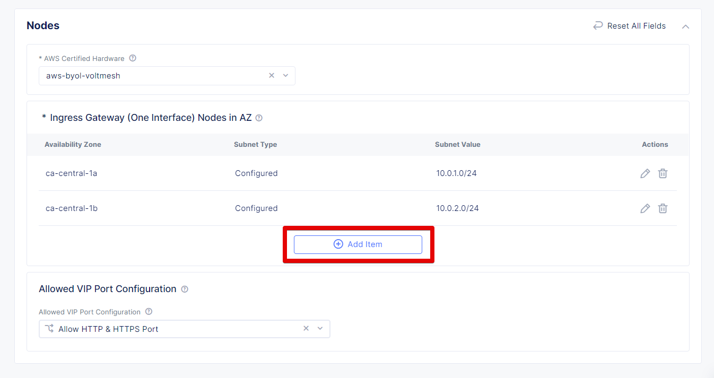
 
Select **ca-central-1d** from the AWS AZ Name menu and enter new subnet address **10.0.3.0/24** in IPv4 Subnet. Then click **Apply** to save the node settings. 
 
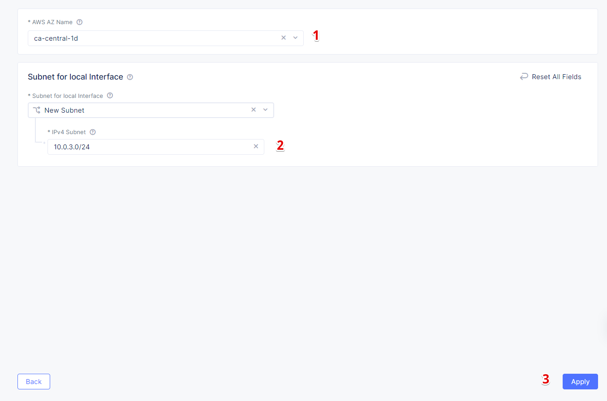
 
After we configured 3 nodes, let’s proceed and apply the configuration.  
  
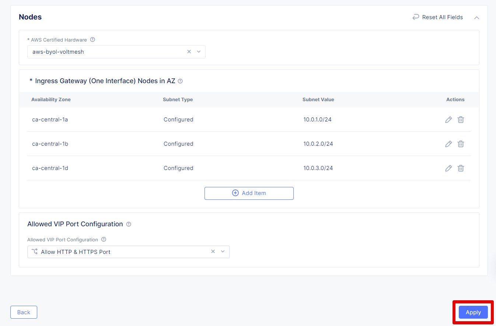
 
Let’s set the deployment type. From the Automatic Deployment drop-down menu, select **Automatic Deployment**, then select an existing AWS credentials object. 
 
.. figure:: assets/deployment.png 
 
Next, we will configure Desired Worker Nodes in the advanced configuration. To do that, in the **Advanced Configuration** section, enable the **Show Advanced Fields** option. 
Then open the Desired Worker Nodes Selection menu. 
  
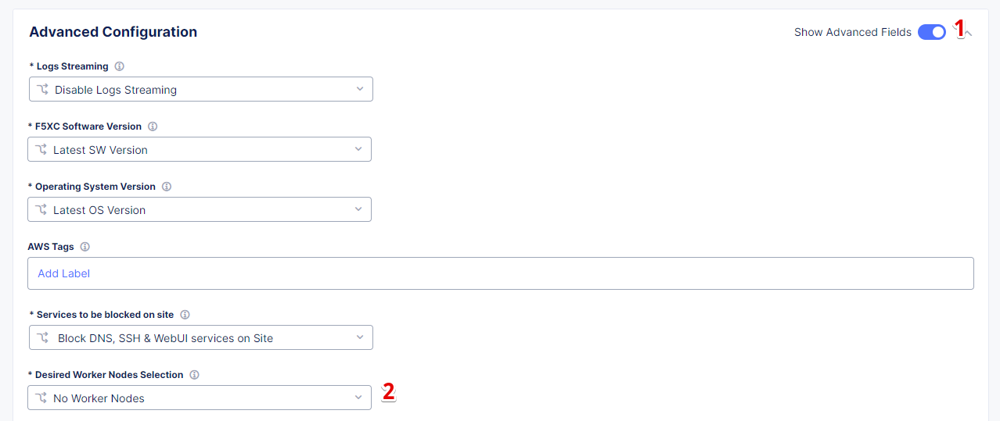
 
From the Desired Worker Nodes Selection menu, select the **Desired Worker Nodes Per AZ** option and enter the number of worker nodes **1** for this demo. The number of worker nodes you set here will be created per the availability zone in which you created nodes.  
Then click the **Save and Exit** button to complete the AWS VPC site creation. 
 
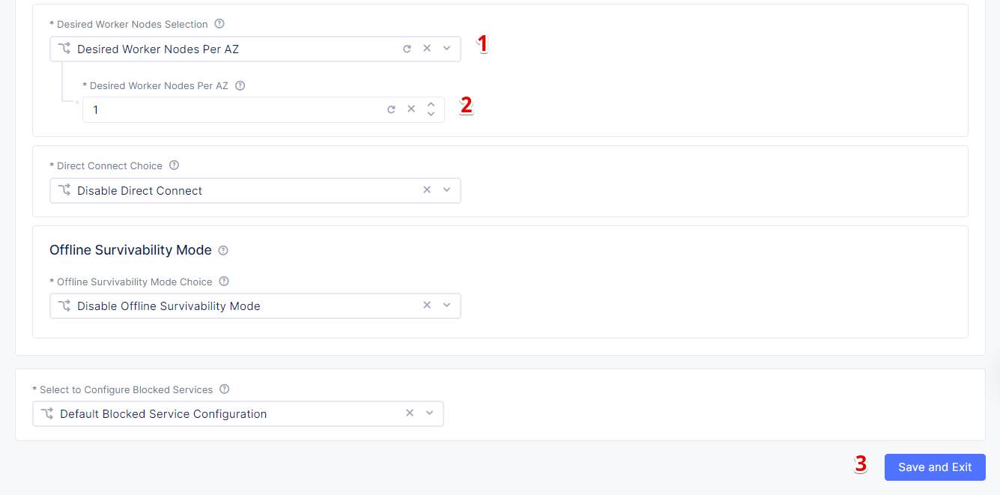
 
Note that site upgrades may take up to 10 minutes per site node. Once a site upgrade has been completed, we need to apply the Terraform parameters to site via Action menu on cloud site management page. The Status box for the VPC site object displays Generated. So, click **Apply** in the Actions column. 
  
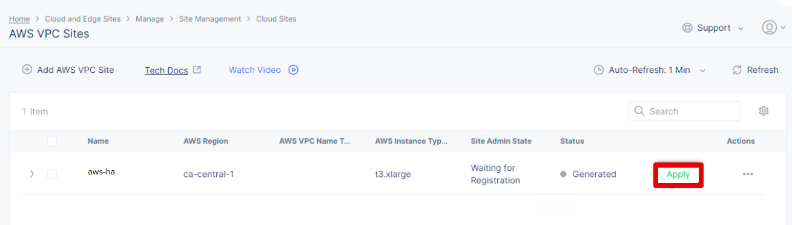
 
First, the Status field for the AWS VPC object changes to Apply Planning. Wait for the apply process to complete and the status to change to Applied. 

Attaching label 
***************
 
When the site is created, the label should be assigned. Use the *ves.io/siteName* label to name the site. Follow the instructions below to configure the site. 
 
First, open the menu of the created AWS VPC site and navigate to **Manage Configuration**. 
 
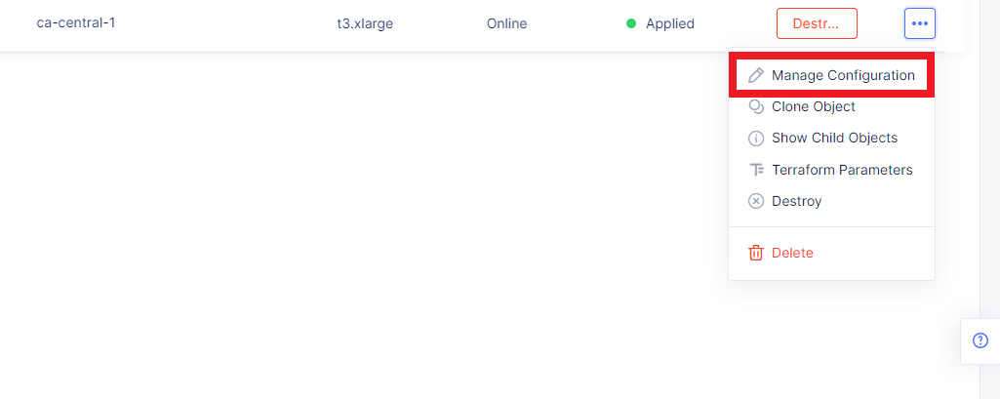
 
Open the editing mode and click **Add Label**. 
  
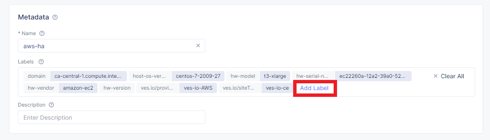
 
As mentioned before, select the **ves.io/siteName** key.  
 
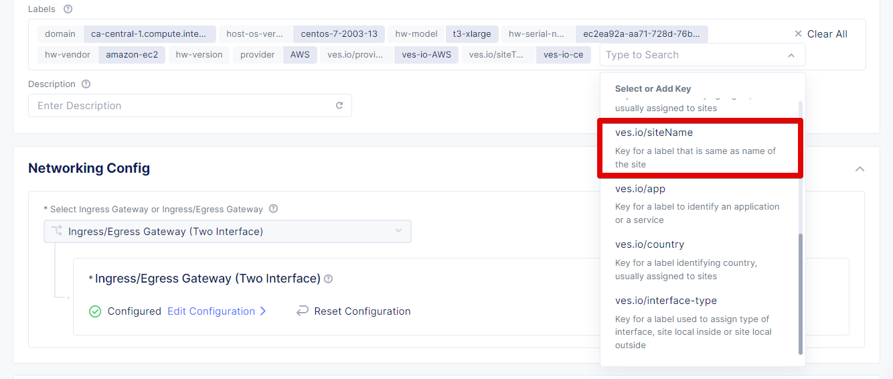
 
And then type in the AWS VPC site name so assign its custom value as the key.  
  
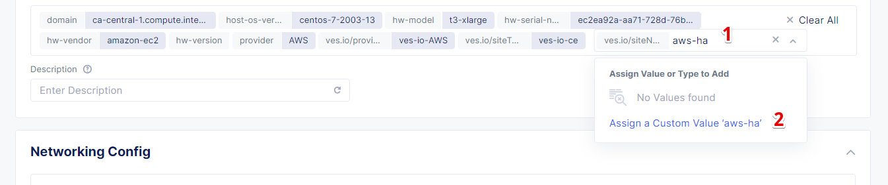
 
Click **Save and Exit** to apply the label configuration.  
  
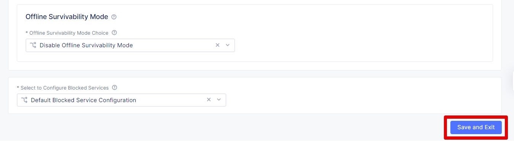
 
Creating Virtual Site
********************* 
 
As soon as an edge site is created and the label is assigned, create a virtual site, as described below. The virtual site should be of the CE type and the label must be *ves.io/siteName* with operation *==* and the name of the AWS VPC site.  
 
Navigate to the **Distributed Apps** service and select **Virtual Sites** in the Manage section. After that click **Add Virtual Site** to load the creation form. 
 
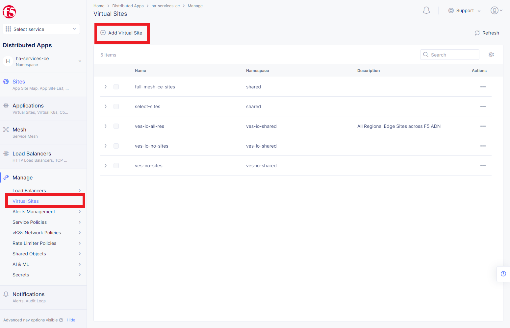
 
In the Metadata section Name field, enter a virtual site name. 
In the **Site Type** section, select the **CE** site type from the drop-down menu, and then move on to adding label.  
 
.. figure:: assets/vs.png
 
Now we will configure the label expression. First, select **ves.io/siteName** as a key. 
  
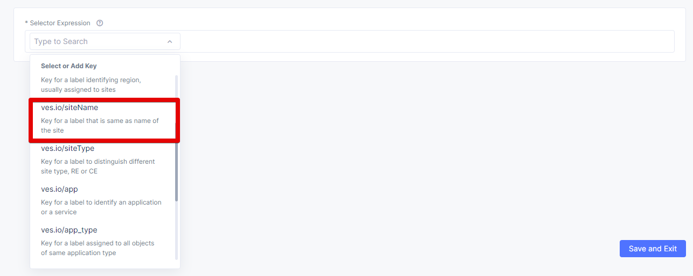
 
Then select the **==** operator. 
  
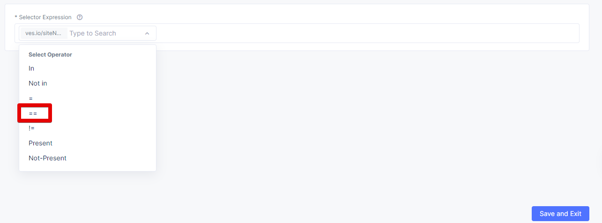
 
And finally, type in the AWS VPC site name, assign it as a label value, and complete the process by clicking the **Save and Exit** button.  
  
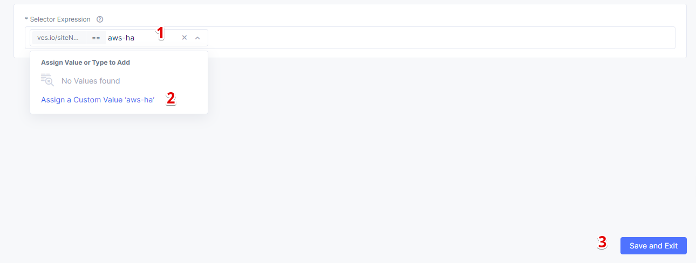
 
Note the virtual site name, as it will be required later. 
 
Creating VK8S cluster 
********************
 
At this point, our edge site for the HA Database deployment is ready. Now create the VK8S cluster. Select both virtual sites (one on CE and one on RE) by using the corresponding label: the one created earlier and the *ves-io-shared/ves-io-all-res*. The *all-res* one will be used for the deployment of workloads on all RE’s. 
 
Navigate to the Virtual K8s and click the **Add Virtual K8s** button to create a vK8s object. 
 
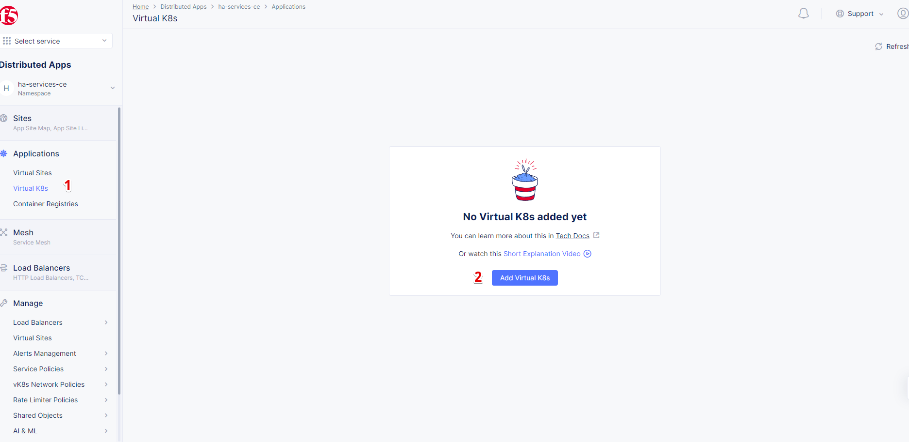
 
In the Name field, enter a name. In the Virtual Sites section, select **Add item**.  
  
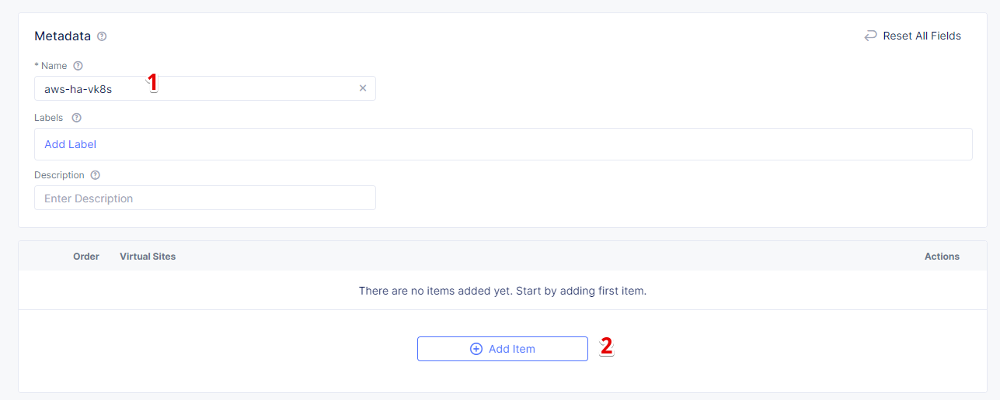
 
Then select the virtual site we created using the Select Item pull down menu. Click **Add Item** again to add the second virtual site which is on RE. 
  
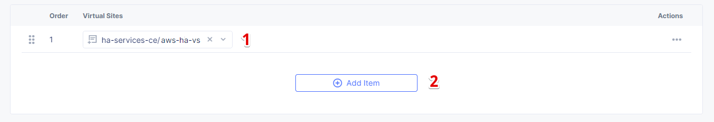
 
Select the **ves-io-shared/ves-io-all-res**. The all-res one will be used for the deployment of workloads on all REs. It includes all regional edge sites across F5 ADN.  
Complete creating the vK8s object by clicking **Save and Exit**. Wait for the vK8s object to get created and displayed. 
  
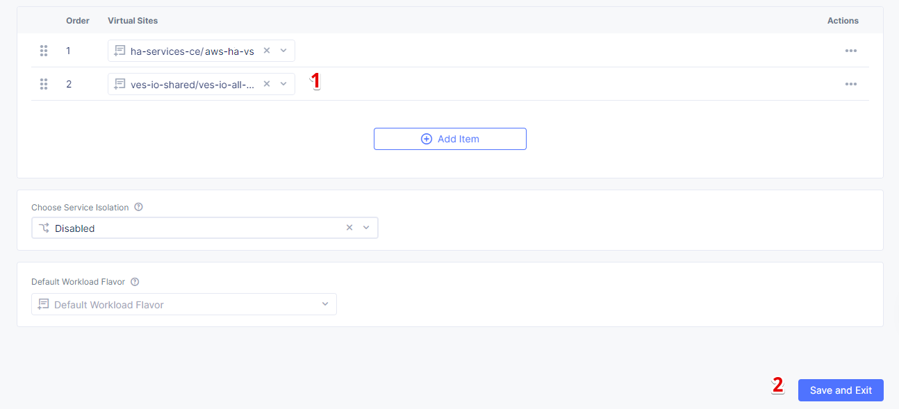
 
Step 2: Deploy HA PostgreSQL to CE 
##################################

Now that the environment for both RE and CE deployments is ready, we can move on to deploying HA PostgreSQL to CE. We will use Helm charts to deploy a PostgreSQL cluster configuration with the help of Bitnami, which provides ready-made Helm charts for HA databases: MongoDB, MariaDB, PostgreSQL, etc., in the following repository: `https://charts.bitnami.com/bitnami <https://charts.bitnami.com/bitnami>`_. In general, these Helm charts work very similarly, so the example used here can be applied to most other databases or services.  
 
HA PostgreSQL Architecture in vK8s 
*****************************
 
There are several ways of deploying the HA PostgreSQL. The architecture used in this guide is shown in the picture below. The pgPool deployment will be used to ensure the HA features. 
  
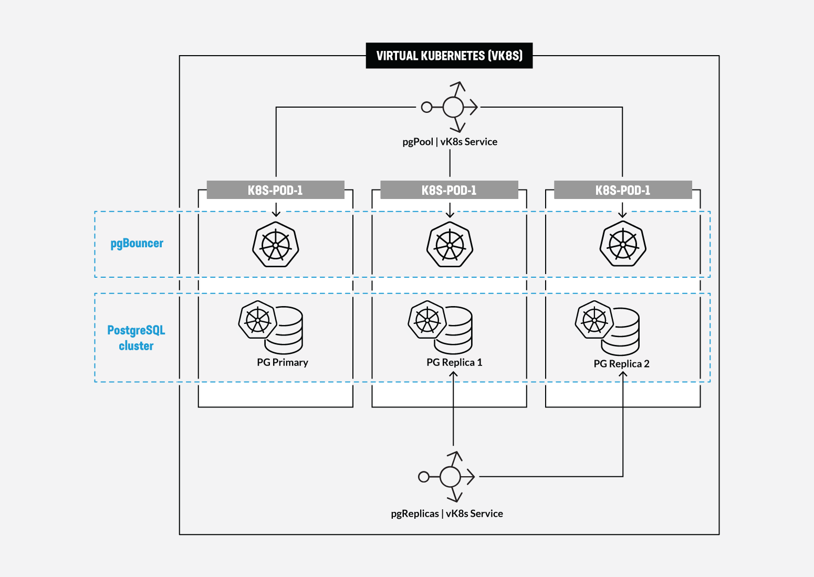
 
Downloading Key
**************
 
To operate with kubectl utility or, in our case, HELM, the *kubeconfig* key is required. xC provides an easy way to get the *kubeconfig* file, control its expiration date, etc. So, let's download the *kubeconfig* for the created VK8s cluster. 
 
Open the menu of the created virtual K8s and click **Kubeconfig**.  
  
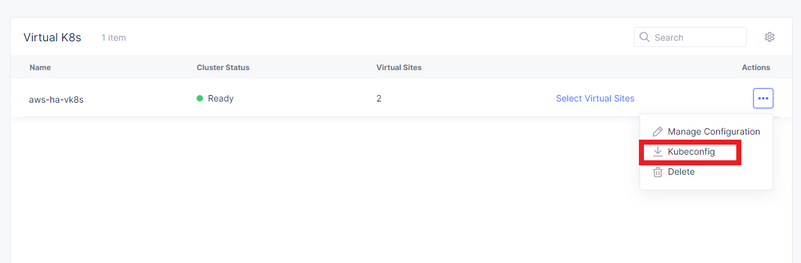
 
In the popup window that appears, select the expiration date, and then click **Download Credential**. 
  
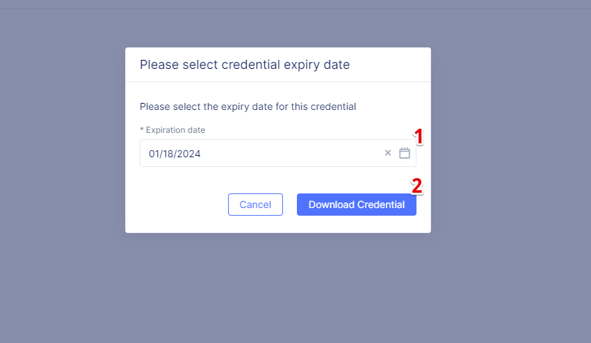

Note: go to the Makefile to replace the name of our *kubeconfig* file with the one you just downloaded. 
 
Making Secrets
************ 
 
VK8s need to download docker images from the storage. This might be *docker.io* or any other docker registry your company uses. The docker secrets need to be created from command line using the *kubectl create secret* command. Use the name of the *kubeconfig* file that you downloaded in the previous step. 
 
NOTE. Please, note that the created secret will not be seen from Registries UI as this section is used to create Deployments from UI. But HELM script will be used in this demo. 
 
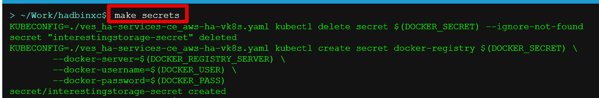
 
 
Updating DB Deployment Chart Values 
********************************
 
Bitnami provides ready charts for HA database deployments. The postgresql-ha chart can be used. The chart install requires setup of the corresponding variables so that the HA cluster can run in xC environment. The main things to change are: *ves.io/virtual-sites* to specify the virtual site name where the chart will be deployed. The CE virtual site we created needs to be specified. Also, clusterDomain key must be set, so that PostgreSQL services could resolve. And finally, the *kubeVersion* key. 
 
Note. It is important to specify memory and CPU resources values for PostgreSQL services unless xC will apply its own minimal values, which are not enough for PostgreSQL successful operation. 
 
To copy and apply the values, navigate to the **Virtual Sites** and copy the virtual site name and the namespace. 
  
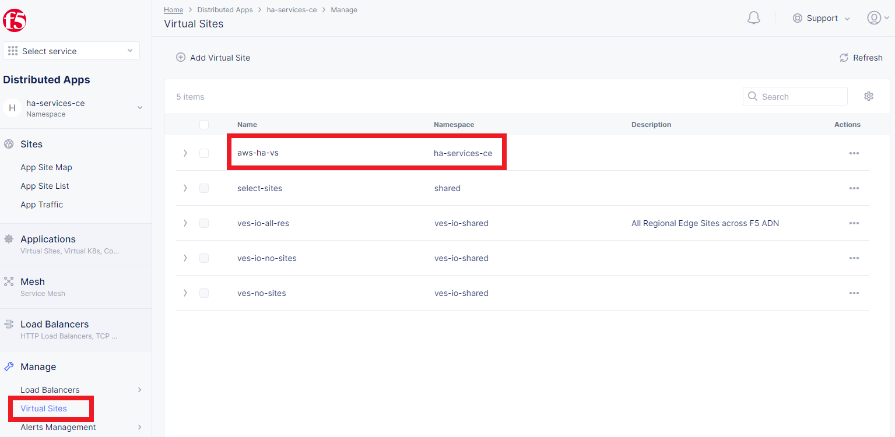
 
Paste the copied values into the *values.yaml*. 
  
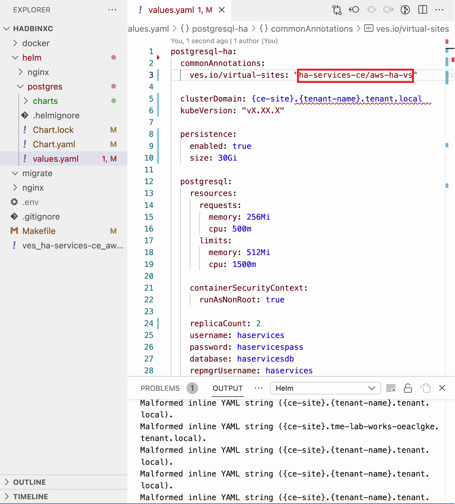
 
An important key in values for the database is *clusterDomain*. Let's proceed to construct the value this way: *{sitename}.{tenant_id}.tenant.local*. Note that *site_id* here is *Edge site id*, not the virtual one. We can get this information from site settings.  
 
First, navigate to the **Cloud and Edge Sites** service, proceed to the **Site Management** section, and select the **AWS VPC Sites** option. Open the **JSON** settings of the site in AWS VPC Site list. **Tenant id** and **site name** will be shown as tenant and name fields of the object. 
 
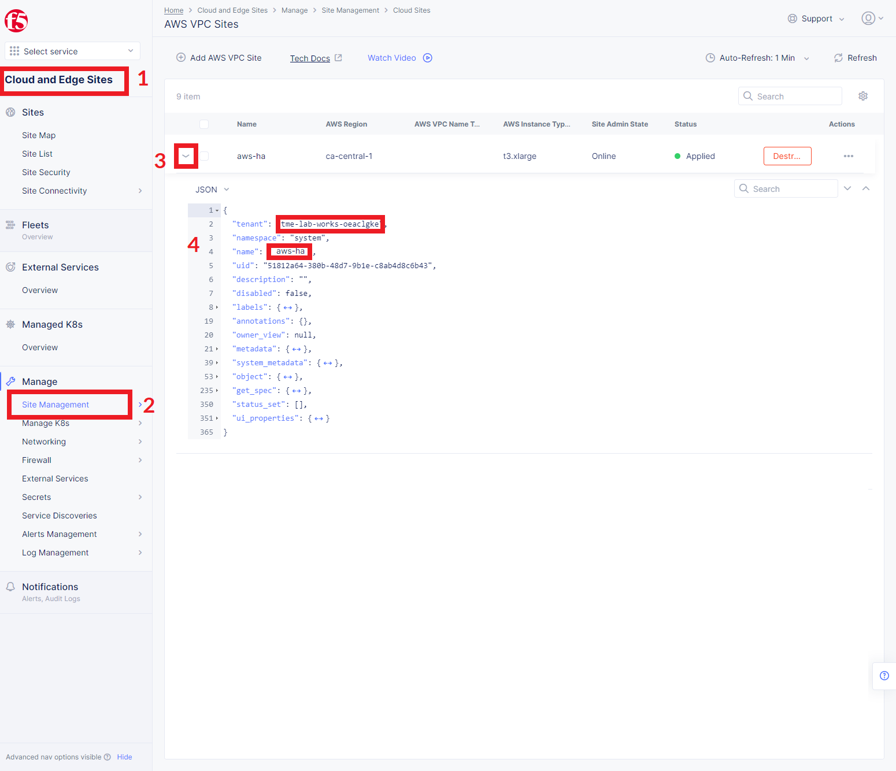
 
VK8S supports only non-root containers, so these values must be specified::

   containerSecurityContext: 
      runAsNonRoot: true 
 
To deploy the load to a predefined virtual site, specify::

  commonAnnotations: 
    ves.io/virtual-sites: "{namespace}/{virtual site name}" 
 
Move on and paste the copied values into the *values.yaml*. 
  
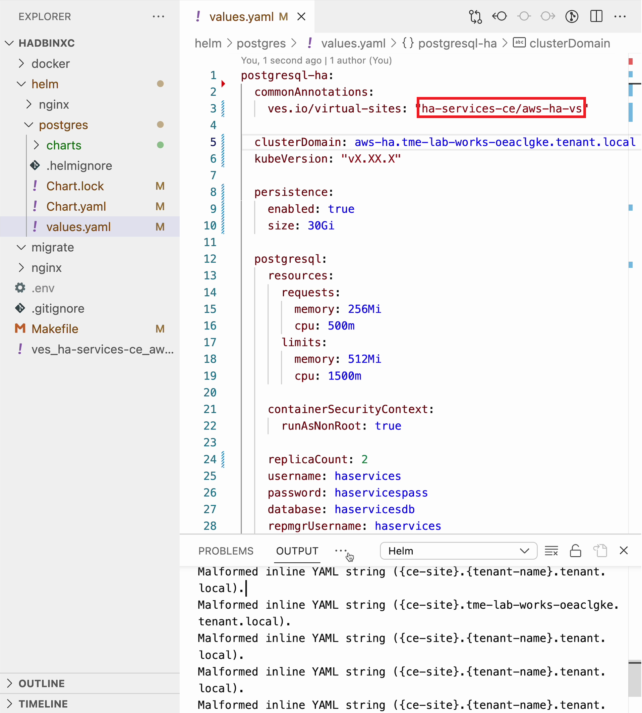
 
And finally, let’s get the *kubeVersion* key. Open the terminal and run the command to get the *kubectl version*. Then copy the value. 
  
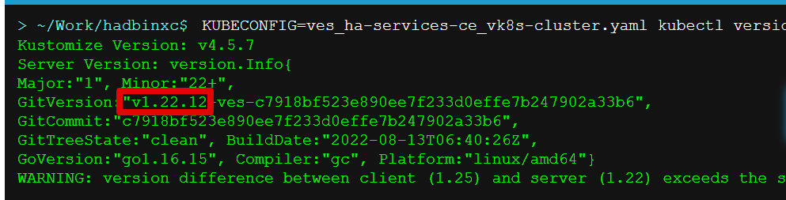
 
After that, go back to the *values.yaml* file and paste the version key into the file. 
  
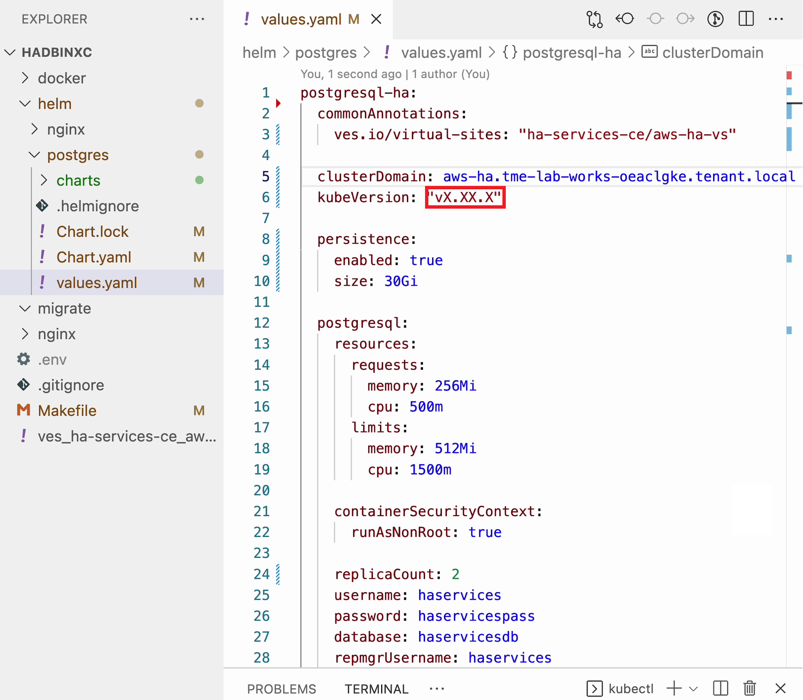
 
 
Deploying HA Postgres chart to xC vK8s
******************************** 
 
As values are now setup to run in xC, deploy the chart to xC vK8s cluster using the *helm upgrade –install* command. 
  
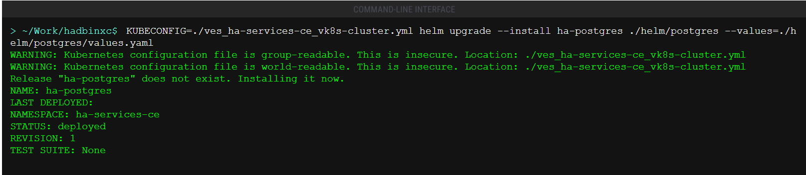
 
Checking deployment 
******************
 
After we deployed the HA Postgres to vK8s, we can check that pods and services are deployed successfully from distributed virtual Kubernetes dashboard. 
 
To do that take the following steps. 
On the Virtual K8s page, click the vK8s we created earlier to drill down into its details. 
  
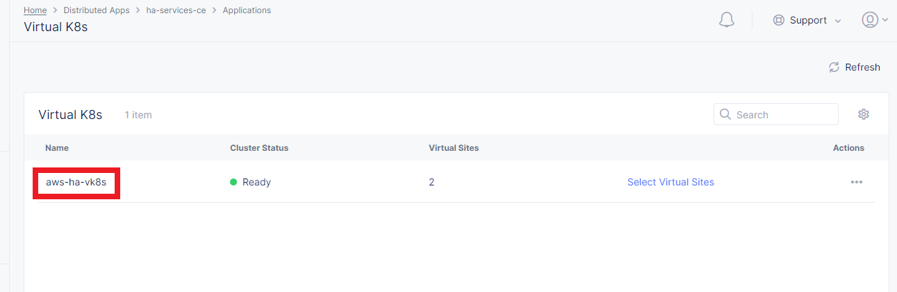
 
Then move on to the **Pods** tab, open the menu of the first pod and select **Show Logs**. 
  
.. figure:: assets/pods.png 
 
Open the drop-down menu to select the *postgresql* as a container to show the logs from.  
  
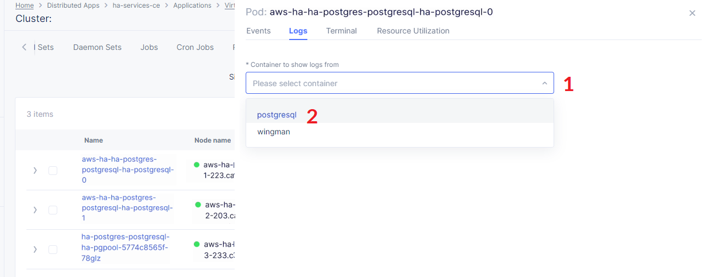
 
As we can see, the first pod is successfully deployed, up and running.  
  
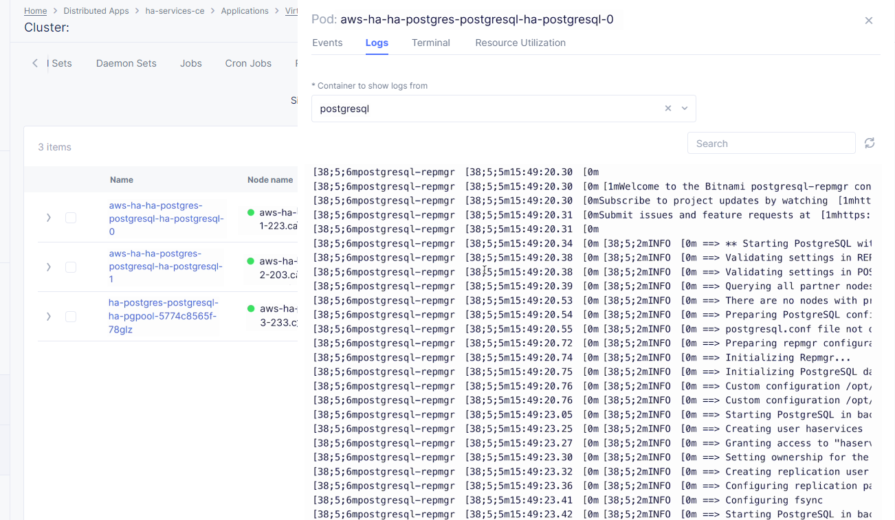
 
Go one step back and take the same steps for the second pod to see its status. That’s what we will see after selecting the *postgresql* as a container to show the logs from: the second pod is up and running and was properly deployed. 
 
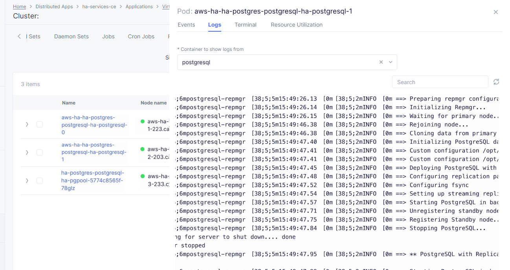

Step 3: Expose CE services to RE deployment
####################################
 
The CE deployment is up and running. Now it is necessary to create a secure channel between RE and CE to communicate. RE will read data from the CE deployed database. To do so, two additional objects need to be created. 
 
 
Exposing CE services 
*****************

To access HA Database deployed to CE site, we will need to expose this service via a TCP Load Balancer. Since Load Balancers are created on the basis of an Origin Pool, we will start with creating a pool.  
 
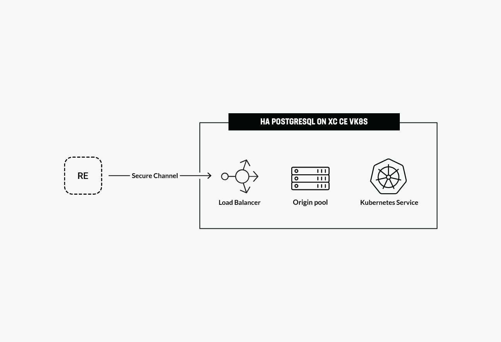
 
Creating origin pool 
*****************
 
To create an Origin Pool for the vk8s deployed service follow the step below. 
 
First, copy the name of the service we will create the pool for. Then navigate to **Load Balancer** and proceed to **Origin Pools**. 
  
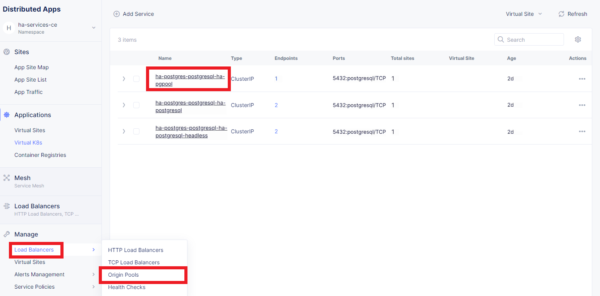
 
Click **Add Origin Pool** to open the origin pool creation form. 
 
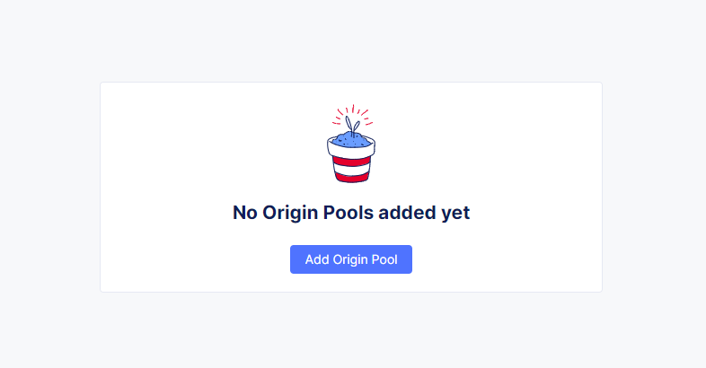
 
In the Name field, enter a name. In the Origin Servers section click **Add Item**. 
 
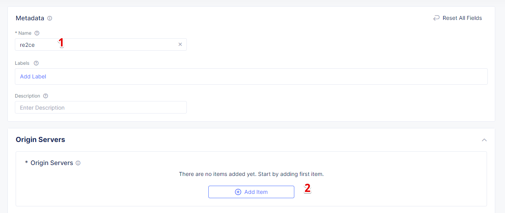
 
From the Select Type of Origin Server menu, select the **K8s Service Name of Origin Server on given Sites** type to specify the origin server with its K8s service name. Then enter the service name **ha-postgres-postgresql-ha-pgpool.ha-services-ce**. Select **Virtual Site** option in the Site or Virtual Site menu. And select a virtual site created earlier. After that, pick the **vK8s Networks on the Site network**. Finally, click **Apply**. 
 
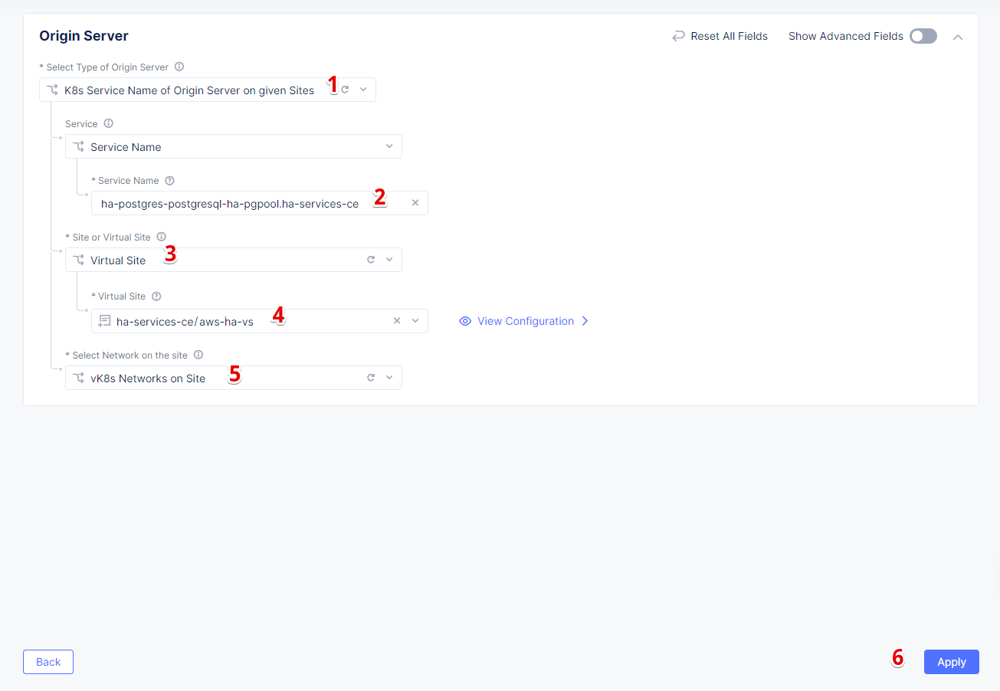
 
Enter a port number in the Port field. We use **5432** for this guide. And complete creating the origin pool by clicking **Save and Exit**. 
 
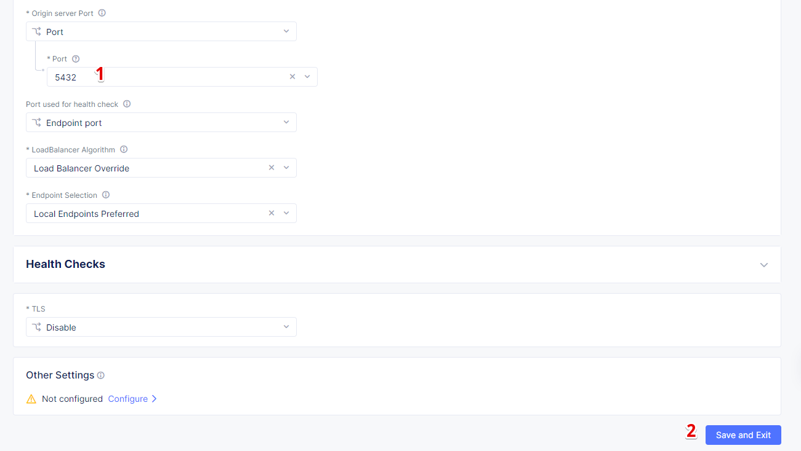
 
Creating TCP Load Balancer
*********************** 
 
As soon as Origin Pool is ready, the TCP Load Balancer can be created, as described below. This load balancer needs to be accessible only from RE network, or, in other words, to be advertised there, which will be done in the next step. 
 
Navigate to the **TCP Load Balancers** option of the Load Balancers section. Then click **Add TCP Load Balancer** to open the load balancer creation form. 
 
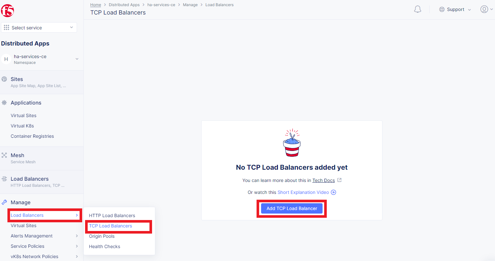
 
In the Metadata section, enter a name for your TCP load balancer. Then click **Add item** to add a domain.  
  
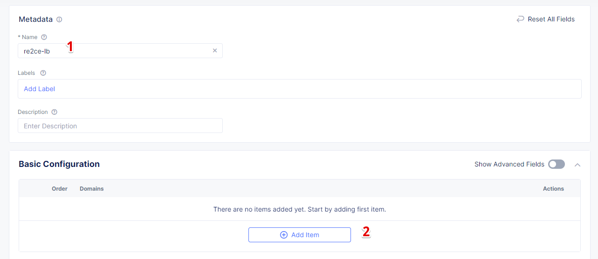
 
In the Domains field, enter the name of the domain to be used with this load balancer – **re2ce.internal**, and in the Listen Port field, enter a **5432** port. This makes it possible to access the service by TCP Load Balancer domain and port. If the domain is specified as re2ce.internal and port is 5432, the connection to the DB might be performed from the RE using these settings. 
Then move on to the **Origin Pools** section and click **Add Item** to open the configuration form. 
 
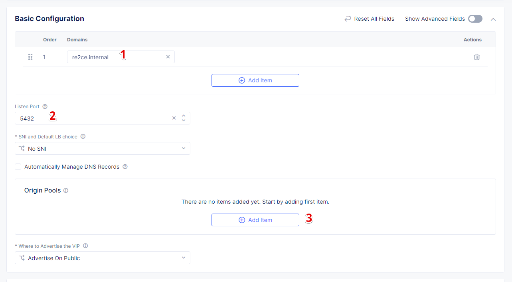
 
From the Origin Pool drop-down menu, select the origin pool created in the previous step and **Click Apply**. 
 
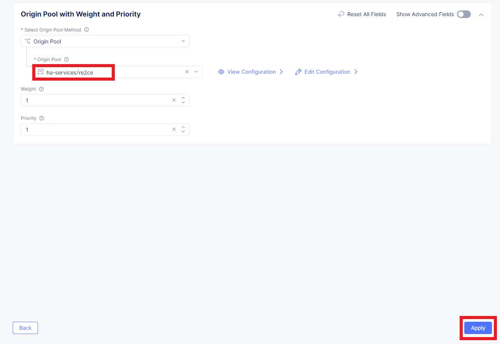
 
Advertising Load Balancer on RE
************************** 
 
From the **Where to Advertise the VIP** menu, select **Advertise Custom** to configure our own custom config and click **Configure**. 
 
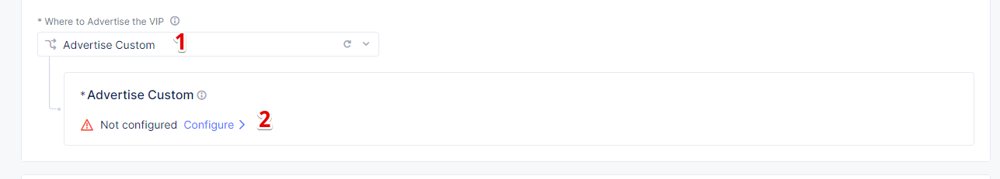
 
Click **Add Item** to add a site to advertise. 
  
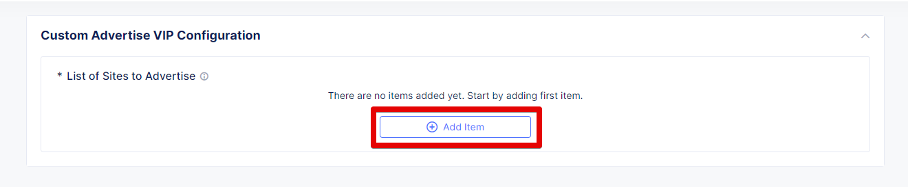
 
First, select **vK8s Service Network on RE** for Select Where to Advertise field. Then select **Virtual Site Reference** for the reference type, and assign **ves-io-shared/ves-io-all-res** as one. Move on to configure a **TCP listener port** as **5432**. Finally, click **Apply**. 
  
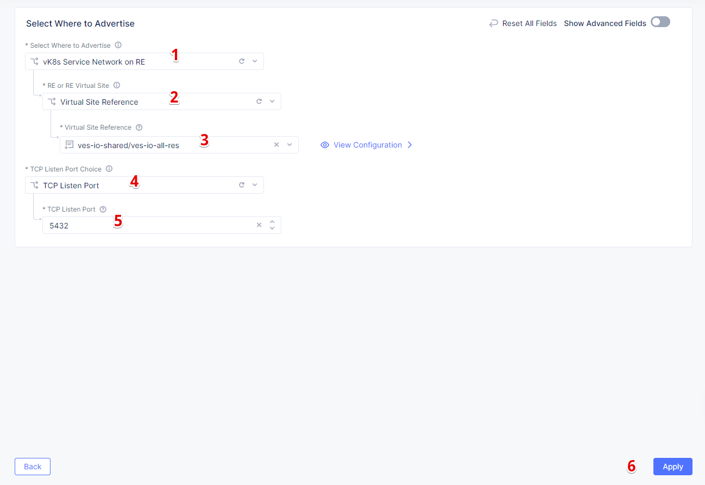
 
 Take a look at the custom advertise VIP configuration and proceed by clicking **Apply**. 
  
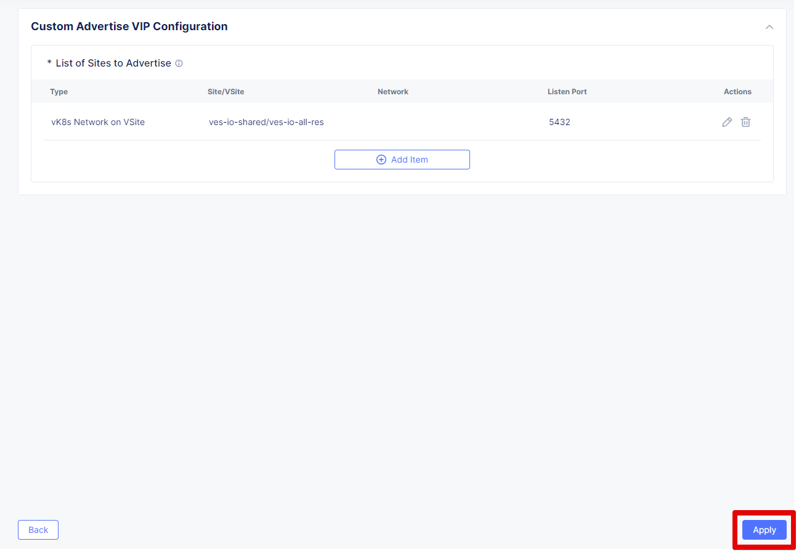
 
Complete creating the load balancer by clicking **Save and Exit**. 
 
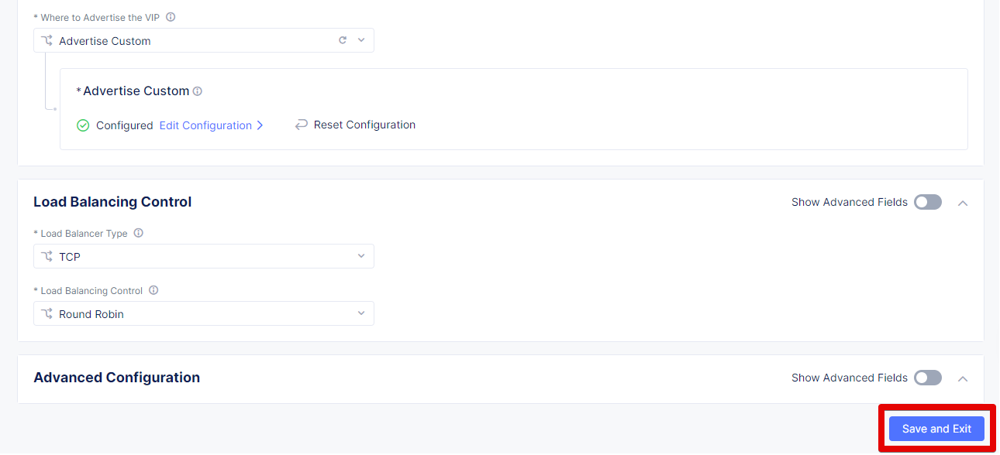

Step 4: Test connection from RE to DB
################################# 
 
Infrastructure to Test the deployed Postgres SQL 
****************************************
 
To test access to the CE deployed Database from RE deployment, we will use an NGINX reverse proxy with a module that gets data from PosgreSQL and this service will be deployed to the Regional Edge. It is not a good idea to use this type of a data pull in production, but it is very useful for test purposes. So, test user will query the RE Deployed NGINX Reverse proxy, which will perform a query to the database. The HTTP Load Balancer and Origin Pool also should be created to access NGINX from RE.  

.. figure:: assets/diagram4.png 

 
Initializing the database
************************
 
To query our PostgreSQL  data, the data should be first put in the database. The easiest way to initialize a database is to use the migrate/migrate project. We will use a dockerfile…… The only customization required is to run the docker in non-root mode. 
  
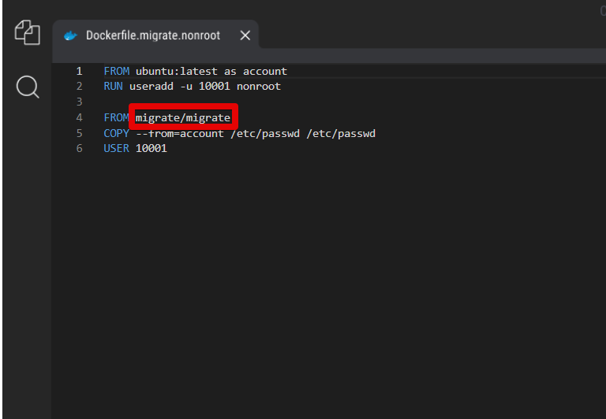
 
NGINX Reverse Proxy with Postgres Module 
****************************************
 
Default NGINX build does not have PostgreSQL Module included. Luckily, the OpenResty project allows easy compiling NGINX with the module. Edit this… run this…  
  
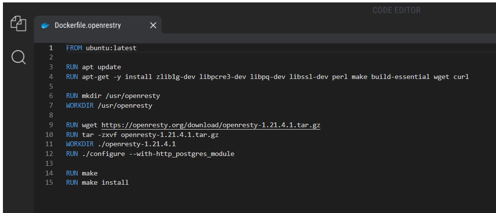
 
The NGINX deployed on RE should run in non-root mode. The below Dockerfile represents…. That should be run in …  
  
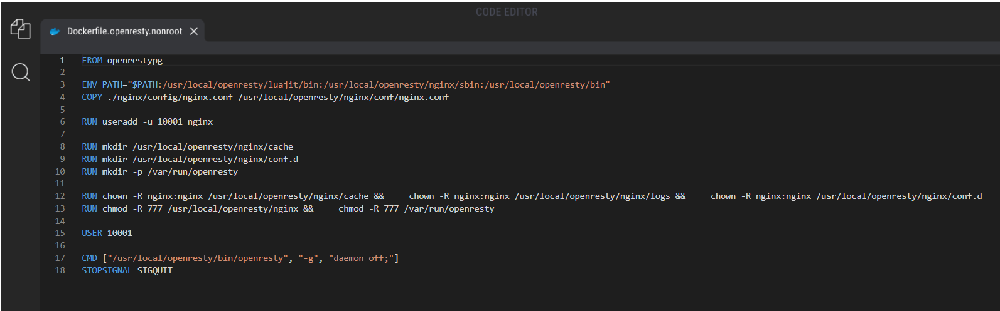
 
 
NGINX Reverse Proxy Config to Query Postgres DB 
***********************************************
 
NGINX creates a server, listening to port 8080. The default location gets all items from article table and caches them. The following NGINX config sets up the reverse proxy configuration, with the database specified on the hostname “re2ce.internal” with the default port because we have configured the TCP load balancer. It also sets up a server on a port 8080 to present the query data that returns all items from the “articles” table.  
  
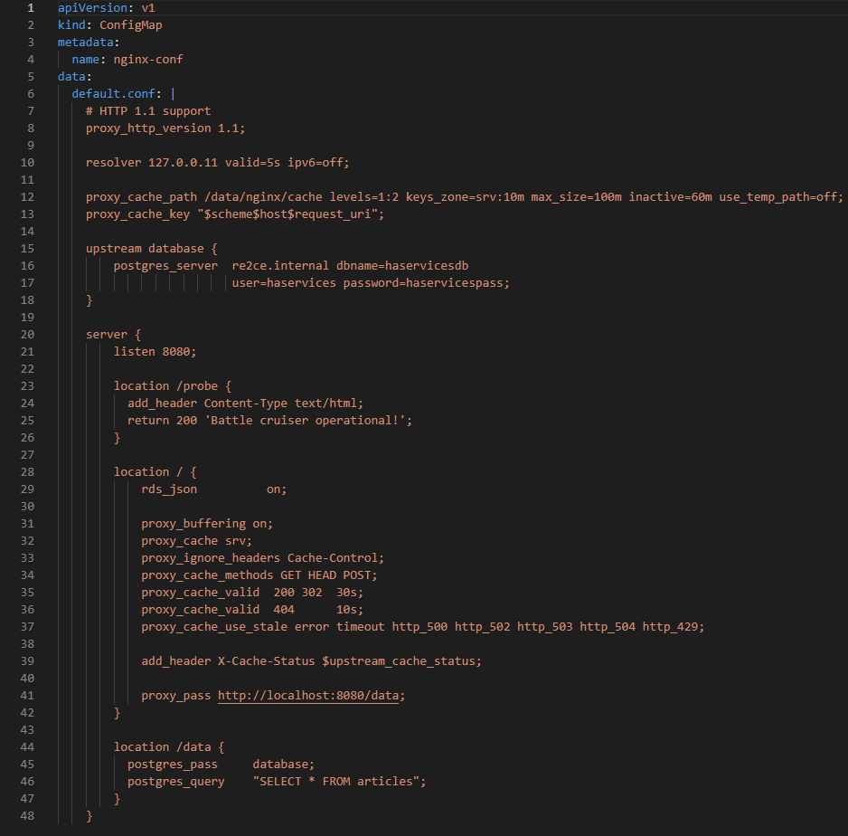
 
Deploying NGINX Reverse Proxy
*************************** 
 
To deploy NGINX call *helm upgrade --install nginx-reverseproxy* by running this command on….. 
  
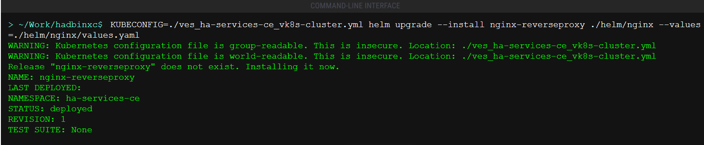
 
 
Overviewing the NGINX Deployment 
******************************
 
The vK8s deployment now has additional RE deployments, which contain the newly-configured NGINX proxy. The RE locations included many Points of Presence (PoPs) worldwide, and when selected, it is possible to have our Reverse Proxy service deployed automatically to each of these sites. 
 
Let's now take a look at the NGINX Deployment. Go back to the **F5 Distributed Cloud** console and navigate to the **Distributed Apps** service. Proceed to the **Virtual K8s** and click the one we created earlier.
   
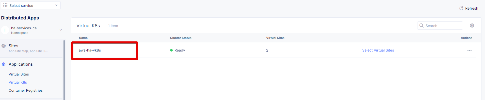
 
Here we can drill down into the cluster information to see the number of pods in it and their status, deployed applications and their services, sites, memory and storage.  
Next, let’s look at the pods in the cluster. Click the **Pods** tab to proceed.  
  
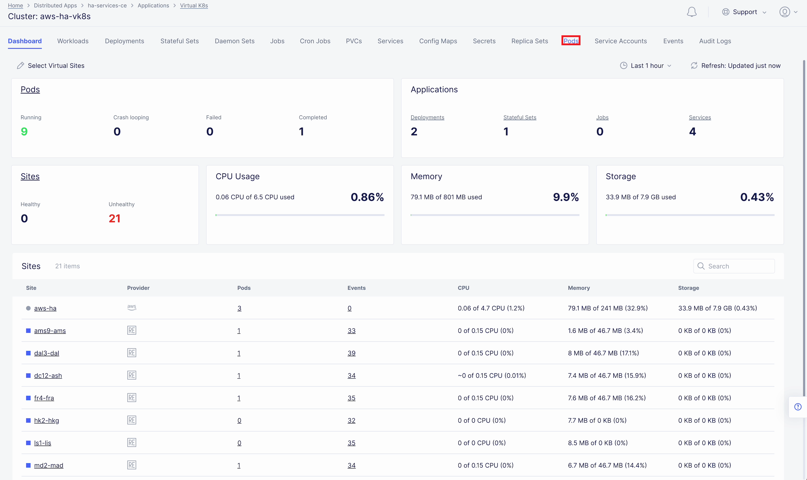
 
Here we will drill into the cluster pods: their nodes, statuses, virtual sites they are referenced to and more.  
  
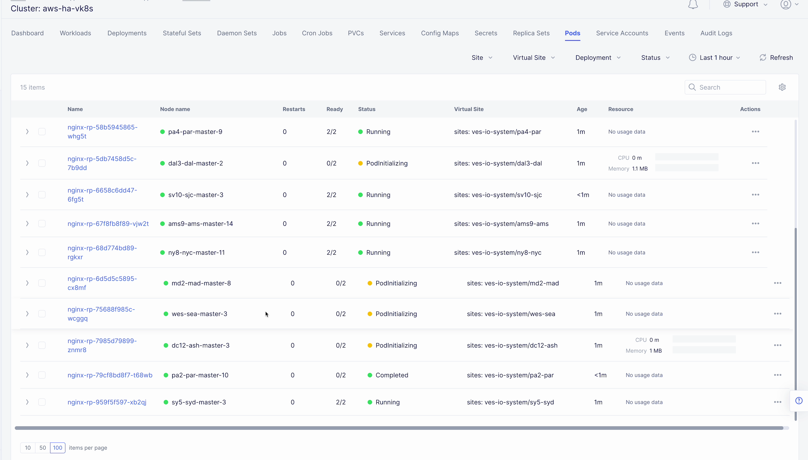
 
Creating HTTP Load Balancer 
***************************
 
To access our NGINX module that pulls the data from PostgreSQL we need an HTTP Load Balancer. This load balancer needs to be advertised on the internet so that it can be accessed from out of the vK8s cluster. Let's move on and create an HTTP Load Balancer. 
 
Navigate to **Load Balancers** and select the **HTTP Load Balancers** option. Then click the **Add HTTP Load Balancer** button to open the creation form. 
  
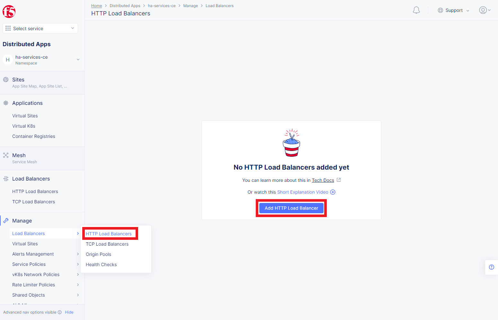
 
In the Name field, enter a name for the new load balancer. Then proceed to the Domains section and fill in the **nginx.domain**. 
  
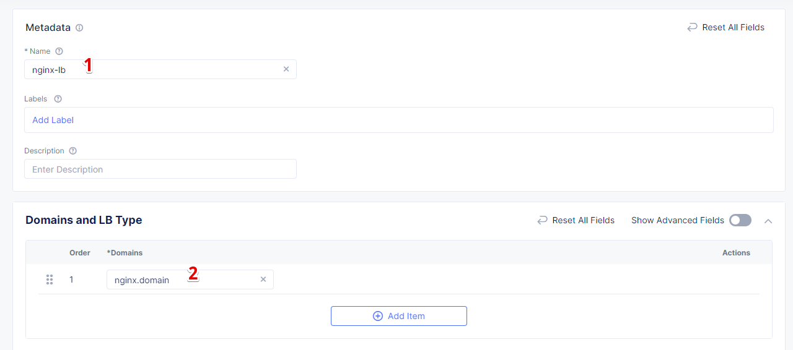
 
Next, from the Load Balancer Type drop-down menu, select **HTTP** to create the HTTP type of load balancer. After that move on to the **Origins** section and click **Add Item** to add an origin pool for the HTTP Load Balancer. 
 
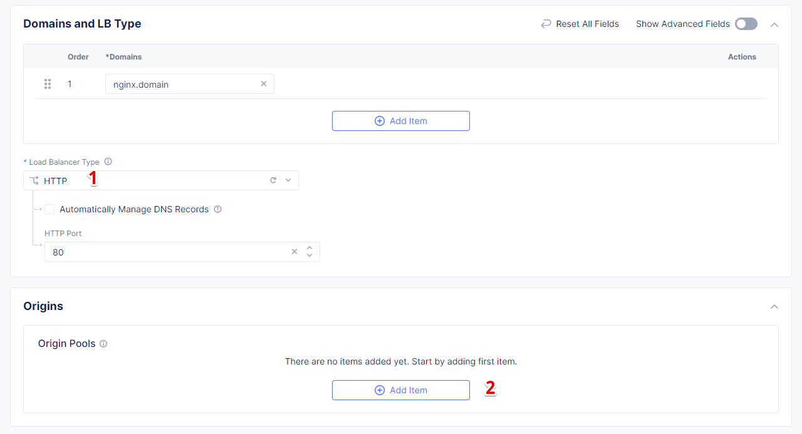
 
To create a new origin pool, click **Add Item**. 
  
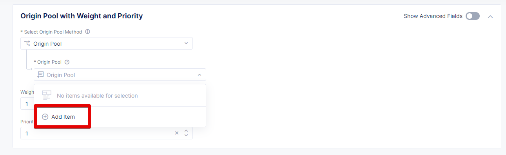
 
First, give it a name, then specify the **9080** port and proceed to add **Origin Servers** by clicking the **Add Item** button. 
  
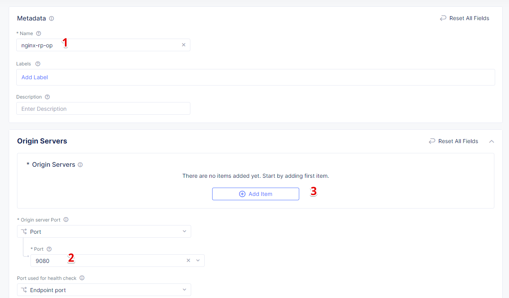
 
First, from the Select Type of Origin Server menu, select **K8s Service Name of Origin Server on given Sites** to specify the origin server with its K8s service name. Then enter the **nginx-rp.ha-services-ce** service name in the Service Name field. Next, select the **Virtual Site** option in the Site or Virtual Site menu to select **ves-io-shared/ves-io-all-res** site which includes all regional edge sites across F5 ADN. After that select **vK8s Networks on Site** which means that the origin server is on vK8s network on the site and, finally, click **Apply**. 
 
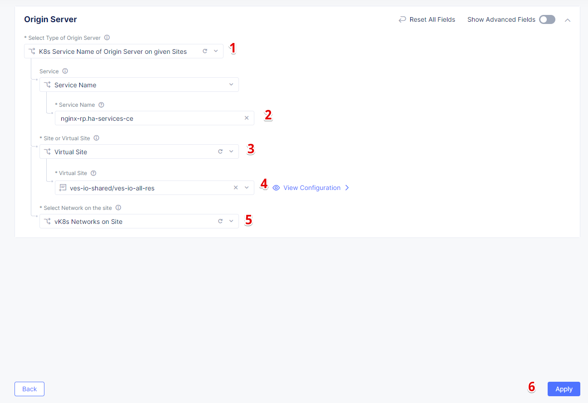
 
Click **Continue** to move on to apply the origin pool configuration. 
 
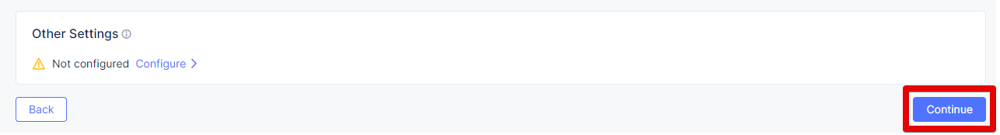
 
Click the **Apply** button to apply the origin pool configuration to the HTTP Load Balancer. 
  
.. figure:: assets/poolapply.png 
 
Complete creating the load balancer by clicking **Save and Exit**. 
  
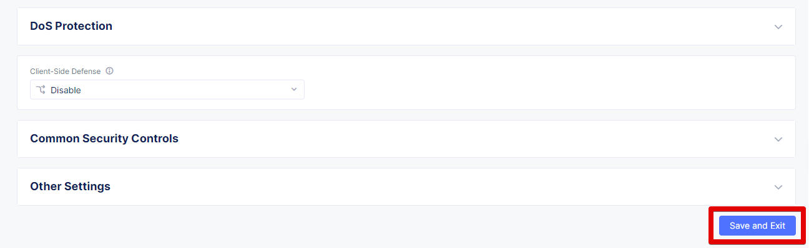
 
Testing: Request data from PostgreSQL DB 
************************************
 
So, in just a few steps above, the HTTP Load Balancer is set up and can be used to access the reverse Proxy which pulls the data from our PostgreSQL DB backend deployed on the CE. Let's copy the generated **CNAME value** of the created HTTP Load Balancer to test requesting data from the PostgreSQL database.  
 
Click on the copy icon. 
  
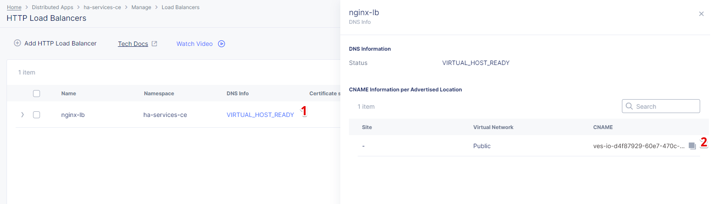
 
Go to your browser and open the developer tools. Then paste the copied CNAME value. Take a look at the loading time. 
  
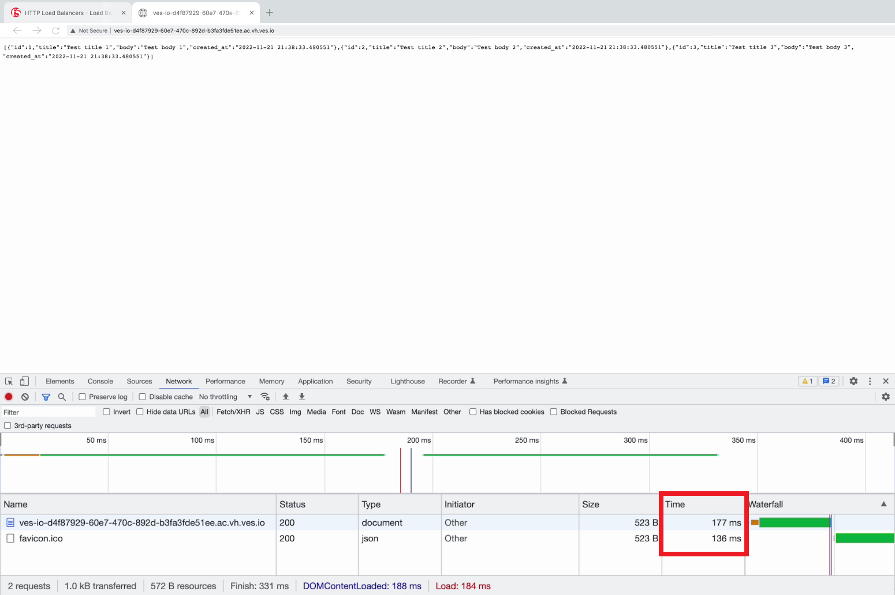
 
Refresh the page and pay attention to the decrease in the loading time. 
  
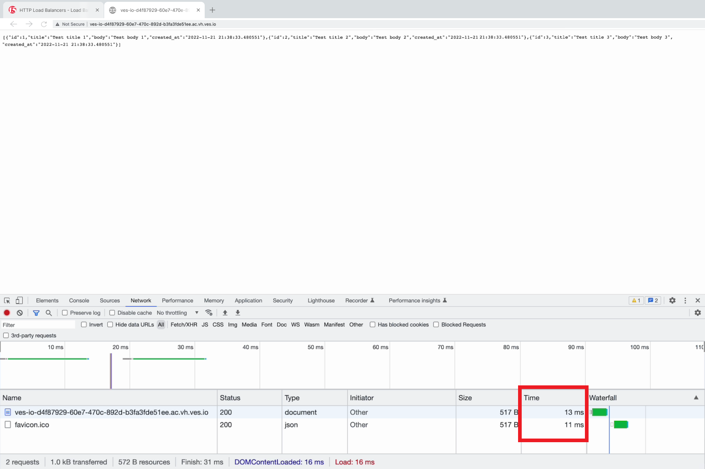
 
 
Wrap-Up
######## 
 
At this stage you should have successfully deployed a distributed app architecture with: 

•	A PostgreSQL database in an HA configuration in a central location, deployed across multiple vK8s pods that run on several compute nodes running within a Customer Edge Site in AWS VPC;
•	A TCP load balancer that exposes and advertises this workload to other deployments within our topology; 
•	An RE deployment that can run across many geographic regions, and contains an NGINX Reverse Proxy with a module that reads the data from our central database. 

Such configuration could be used as a reference architecture for deploying a centralized database or backend service by way of Helm Charts running in Kubernetes, which can be connected to REs containing customer-facing apps & services closer to the users' region. These services can all be deployed and managed via F5 Distributed Cloud Console for faster time-to-value and more control. Of course, any of these services can also be secured with the F5 Web App and API Protection (WAAP) services as well, further improving the reliability and robustness of the resulting architecture.  
 
We hope you now have a better understanding of F5 Distributed Cloud Services that provide virtual Kubernetes (vK8s) capabilities to simplify the deployment and management of distributed workloads across multiple clouds and regions and are now ready to implement them for your own organization. Should you have any issues or questions, please feel free to raise them via GitHub. Thank you! 

