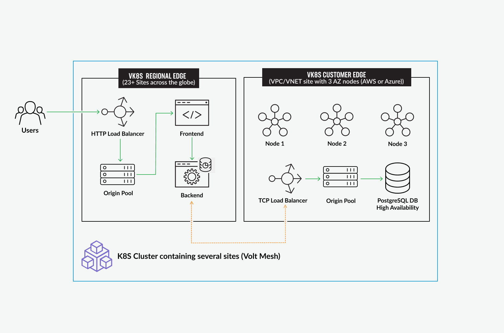

Objective
#########

Use this guide to explore the virtual Kubernetes (vK8s) capabilities F5 Distributed Cloud Services for simplifying deployment and management of distributed workloads 
across multiple clouds and regions. This will help you get familiar with the general pattern of deploying high-availability configurations by using Kubernetes Helm 
charts in a multi-node site, which can then be exposed to other services. This is a common use-case leveraging F5 Distributed Cloud Customer Edge (CE) for deploying a 
backend or a database, which can then be used in conjunction with Regional Edge (RE) deployments that consume and/or interact with the central CE location. 
In this guide we will use an example of a PostgreSQL database deployment in a High-Availability (HA) configuration on a CE and exposing it to a RE location(s) closer 
to end-users for lowered latency, improved performance, and data resiliency. 

The guide includes the following key steps: 

•	Preparing the environment for HA workload; 
•	Deploying HA PostgreSQL database to CE; 
•	Exposing CE services to RE deployment; 
•	Testing the connection from RE to DB. 

The resulting architecture will be a PostgreSQL database deployed in a HA config on Kubernetes running on several compute nodes within an AWS VPC, and exposing to via 
TCP Load Balancer to a service in a RE that reads and presents the database contents to the end-users, which is a perfect fit for a CE deployment.  

 

Resources 
#########

For the detailed information on the use cases covered by this Demo Guide, please see the following resources including DevCentral article(s), YouTube video(s), different versions of this guide specific to Amazon AWS and Microsoft Azure deployment, and automation scripts based on Terraform:

- DevCentral Articles: 

  - `Describing HA for Distributed Apps with F5 Distributed Cloud Services <https://community.f5.com/t5/technical-articles/demo-guide-ha-for-distributed-apps-with-f5-distributed-cloud/ta-p/316759>`_

  - `Outlining the architectural decisions and the solution <https://community.f5.com/t5/technical-articles/deploy-high-availability-and-latency-sensitive-workloads-with-f5/ta-p/309740>`_ 

- YouTube videos:

  - `Marketecture and overview of the HA solution <https://www.youtube.com/watch?v=EA4RYZGMlLA>`_

  - `Discussing the different aspects of this configuration <https://www.youtube.com/watch?v=gGlsbVGjk50&t=0s>`_

- Cloud-Specific Demo Guides: Azure and AWS: 

+---------------------------------------------------------------------------------------------------+-----------------------------------------------------------------------------------------------------------------+
| SaaS Console                                                                                      | Terraform Automation                                                                                            | 
+===================================================================================================+=================================================================================================================+
| `HA for AWS Apps via SaaS Console <https://github.com/f5devcentral/xchaawsdemoguide>`_            | `HA for AWS Apps via Terraform  <https://github.com/f5devcentral/xchaawsdemoguide/tree/main/terraform>`_        | 
+---------------------------------------------------------------------------------------------------+-----------------------------------------------------------------------------------------------------------------+
| `HA for Azure Apps via SaaS Console <https://github.com/f5devcentral/xchaazdemoguide>`_           | `HA for Azure Apps via Terraform  <https://github.com/f5devcentral/xchaazdemoguide/tree/main/terraform>`_       | 
+---------------------------------------------------------------------------------------------------+-----------------------------------------------------------------------------------------------------------------+

