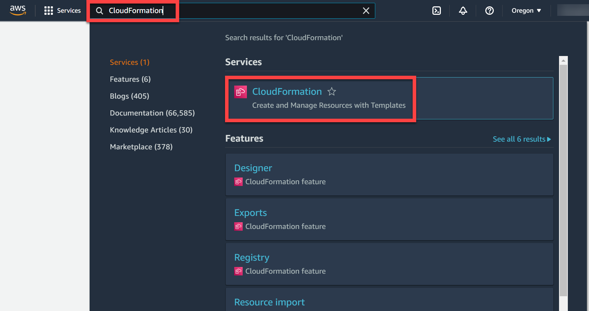
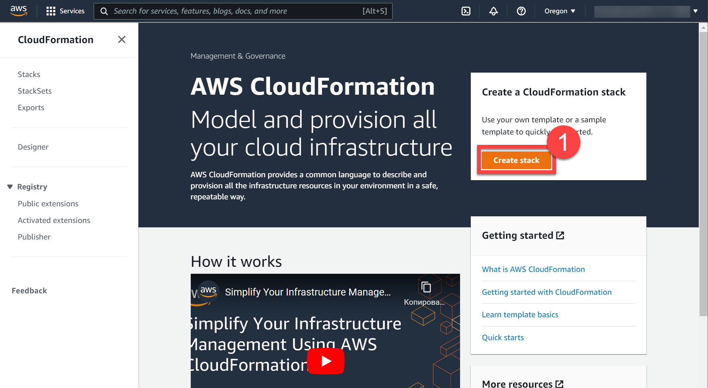
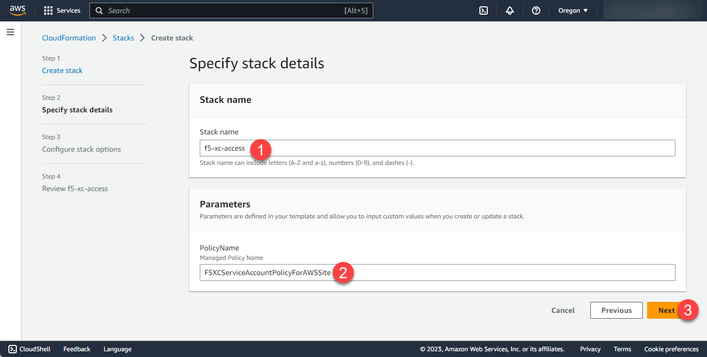
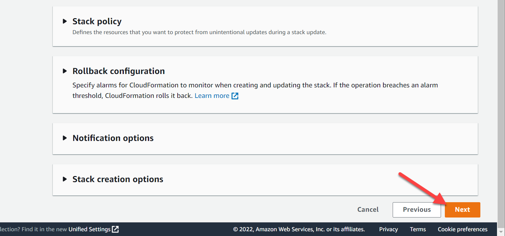
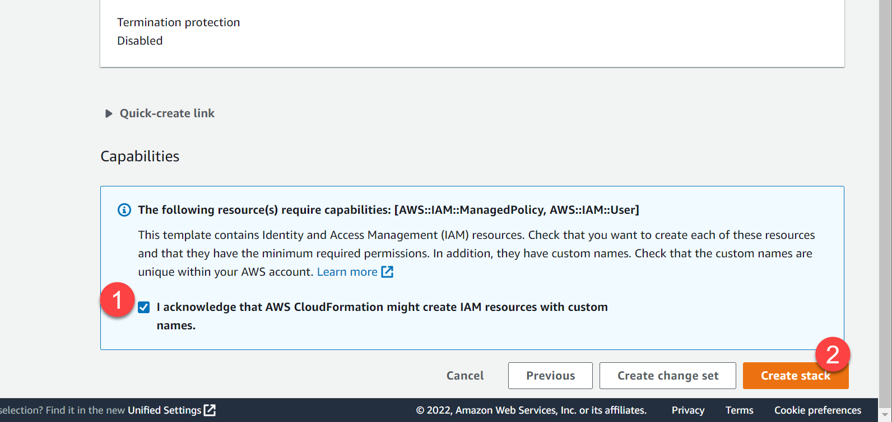
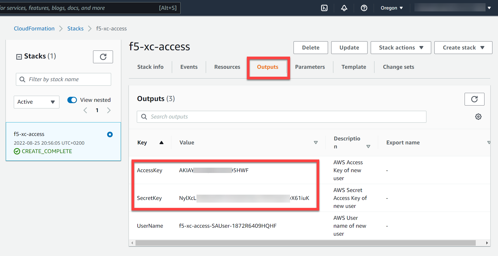
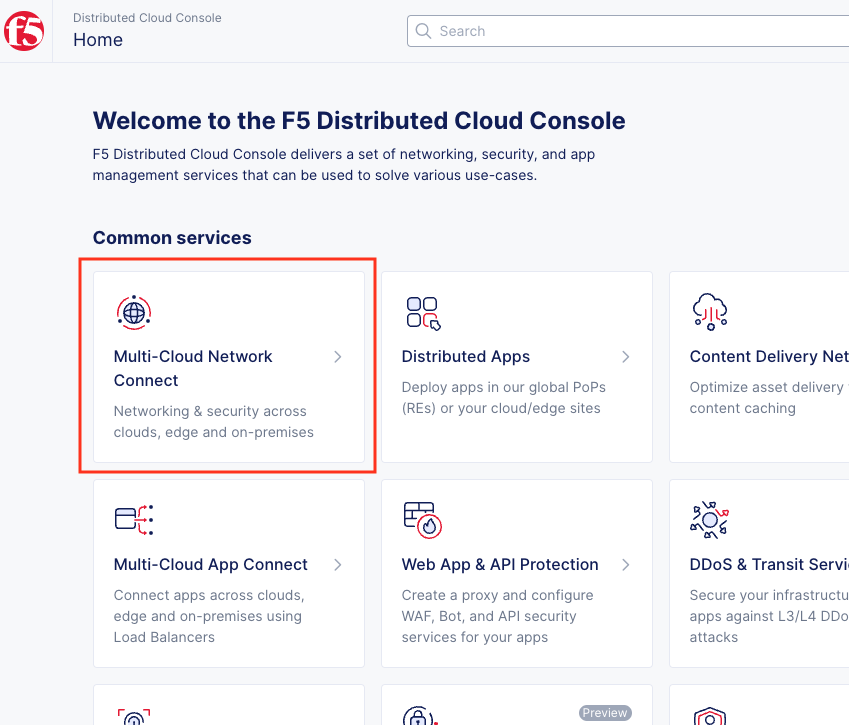
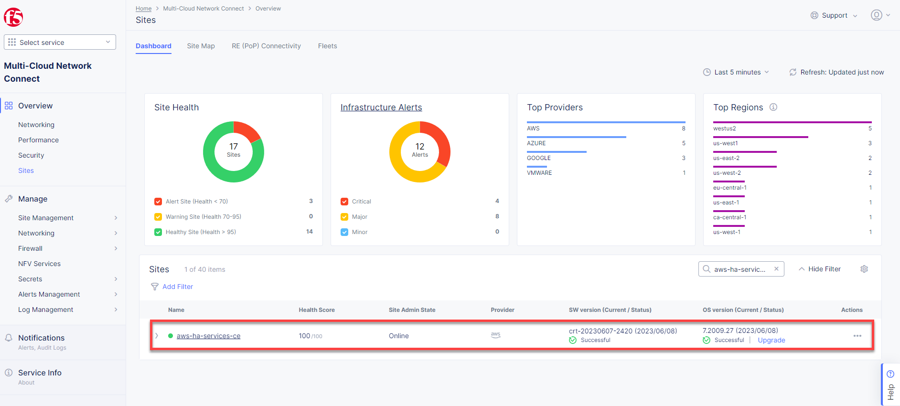

#   Deployment instructions

## Deploy infrastructure

Create stack using the cloud formation template for AWS VPC site.

Sign into your AWS Account and type CloudFormation in the search bar. Then open the CloudFormation service.

Click Create stack.

Upload cloudformation template located in the **./cloudformation/aws-service-account.yaml** and click **Next**.

Fill required parameters and click Next.

* **Stack name** - The name associated with the AWS Cloud Formation stack. For example: xc-cloud-access
* **Policy Name** - The name of the Service Account Policy. For example: F5XCServiceAccountPolicyForAWSSite

Click **Next**.

Check **acknowledge** checkbox and click **Create stack**.

In a few minutes navigate to the **Output** tab and find your **Access Key** and **Access Secret**.

The Access Key and the Secret Key can be used to create the AWS Programmatic Access Credentials on F5® Distributed Cloud Console. See [AWS Cloud Credentials](https://docs.cloud.f5.com/docs/how-to/site-management/cloud-credentials#aws-programmable-access-credentials) for more information.

Open **./aws-site/var.tf** and fill variables with your Access Key and Access Secret.

    variable "aws_access_key" {
        type = string
        default = "your_aws_access_key"
    }

    variable "aws_secret_key" {
        type = string
        default = "your_aws_access_secret"
    }

Find **xc_api_url** variable and fill it with your F5 xC tenant name.

    variable "xc_api_url" {
        type = string
        default = "https://your_tenant.console.ves.volterra.io/api"
    }

Sign in to the F5 Distributed Cloud Console and open **Administration** tab.

Open **Credentials** section and click **Add Credentials**.

Fill the form as on the screen below and download your credentials file.

Copy credentials file to the scripts folder and fix path for the .p12 certificate in the **./aws-site/var.tf** file.

    variable "xc_api_p12_file" {
        default = "./path-to-api-cert.p12"
    }

Create **VES_P12_PASSWORD** environment variable with the password form the previous step.

    export VES_P12_PASSWORD=your_certificate_password

Navigate to the **aws-site** folder and initialize Terraform by running init command.

    cd ./aws-site
    terraform init

Apply Terraform script.

    terraform apply

Save the terraform output

    Outputs:

    aws_access_key_id = "xxxxxxxxxxxxx"
    aws_access_key_secret = <sensitive>
    aws_vpc_ids = [
      "vpc-12345678910",
    ]
    aws_vpc_subnet_a = [
      "subnet-12345678910",
    ]
    aws_vpc_subnet_b = [
      "subnet-12345678910",
    ]
    aws_vpc_subnet_c = [
      "subnet-12345678910",
    ]
    cluster_domain = "aws-ha-services-ce.your_tenant.tenant.local"
    kubecofnig_path = "../kubeconfig.conf"
    tenant_name = "your_tenant"

Open F5 Distributed Cloud Console and navigate to the Multi-Cloud Network Connect tab.

Open **Site List** and check the **Health Score**. It may take some time to provision the node.

## Deploy application

Open **./application** folder and edit the **var.tf** file

Update the **xc_api_p12_file** environment variable with the path for the .p12 certificate.

    variable "xc_api_p12_file" {
        default = "./path-to-api-cert.p12"
    }

Find the **xc_api_url** variable and fill it with your F5 xC tenant name.

    variable "xc_api_url" {
        type = string
        default = "https://your_tenant.console.ves.volterra.io/api"
    }

Find the **cluster_domain** variable in the terraform output from the previous step and update the value in the **var.tf** file. You can also find how to generate it [manually in the guide](https://github.com/f5devcentral/xchacedemoguide#updating-db-deployment-chart-values)

    variable "cluster_domain" {
      type    = string
      default = "your_site_name.your_tenant_full_name.tenant.local"
    }

Fill the docker registry variables with your dockerhub credentials. You can use a [free account](https://hub.docker.com/signup).

    variable "registry_username" {
      type    = string
      default = ""
    }

    variable "registry_password" {
      type    = string
      default = ""
    }

    variable "registry_email" {
      type    = string
      default = ""
    }

Run the **terraform init** command

    terraform init

Run **apply** command to deploy the app

    terraform apply

## AWS-Site Variables description

Variable Name       | Description                                                     | Default Value          
--------------------|-----------------------------------------------------------------|------------------------
environment         | Environment name. Usually match with XC namspace name.          | "ha-services-ce"                   
xc_api_p12_file     | API credential p12 file path.                                   | "../api-creds.p12"                  
xc_api_url          | Tenant API url file path.                                       | "https://**your_tenant_name**.console.ves.volterra.io/api"                   
kubeconfig_path     | Generated vk8s kubeconfig file path.                            | "../kubeconfig.conf"                   
aws_region          | AWS Region name                                                 | "us-east-2"
aws_access_key      | AWS Access Key                                                  | ""
aws_secret_key      | AWS Secret Key                                                  | ""

## Application Variables description

Variable Name       | Description                                                     | Default Value          
--------------------|-----------------------------------------------------------------|------------------------
environment         | Environment name. Usually match with XC namspace name.          | "ha-services-ce"                   
xc_api_p12_file     | API credential p12 file path.                                   | "../api-creds.p12"                  
xc_api_url          | Tenant API url file path.                                       | "https://**your_tenant_name**.console.ves.volterra.io/api"                   
kubeconfig_path     | vk8s kubeconfig file path.                                      | "../kubeconfig.conf"                   
helm_path           | Helm charts path.                                               | "../../helm"
cluster_domain      | Cluster domain in format **{site_name}.{tenant_id}**.tenant.local. Where **site_name** is the Edge site name. Can be generated from [the guide](https://github.com/f5devcentral/xchacedemoguide#step-2-deploy-ha-postgresql-to-ce) or took from the terraform's output of the previous step.    |  **your_site_name.your_tenant_full_name**.tenant.local
registry_username   | Docker Registry Username                                        | ""
registry_password   | Docker Registry Password                                        | ""
registry_email      | Docker Registry Email                                           | ""
virtual_site_name   | Virtual Site Name                                               | "ha-services-ce-vs"

## Delete environment

Run the **terraform destroy** command in the **./application** forlder and then in the **./aws-site folder**

    terraform destroy